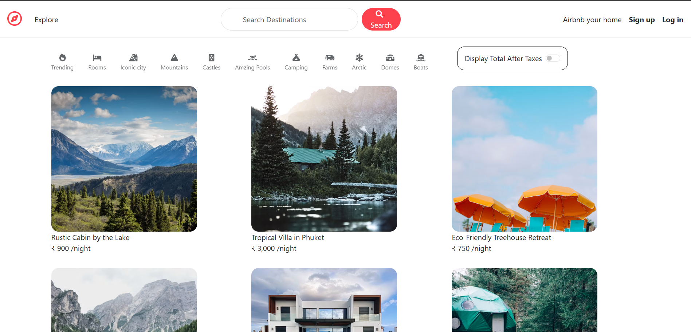
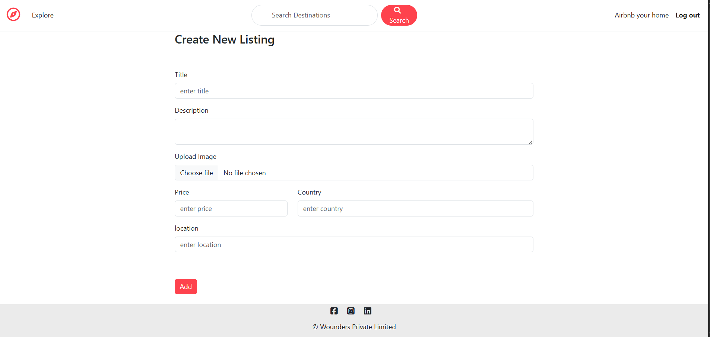
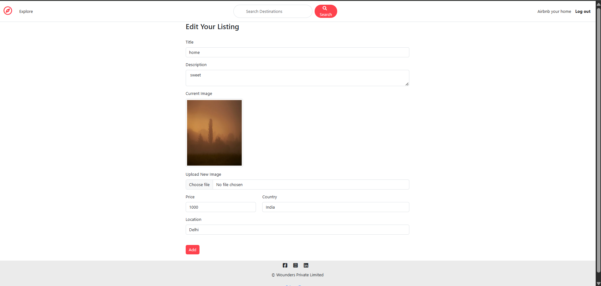
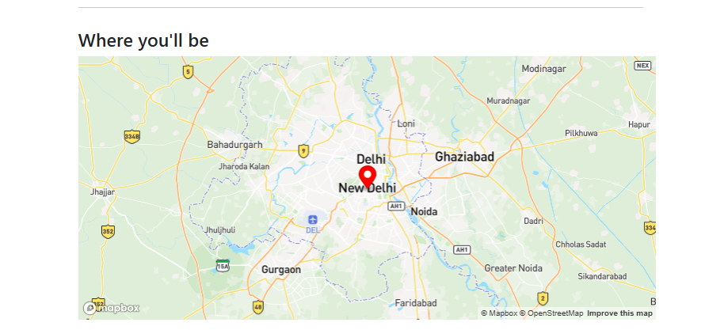

# Wanderlust

A full-stack accommodation listing web application where users can discover, create, edit, and manage property listings with image uploads, authentication, reviews, and interactive maps.

**Live Demo:** [Wanderlust Web App](https://wanderlust-web-app-it03.onrender.com?utm_source=chatgpt.com)

---

## Overview

Wanderlust is a full-stack web application inspired by modern accommodation and vacation-rental platforms.

The application allows users to browse available listings, view detailed property information, create their own listings, upload property images, edit or delete listings, and view property locations on an interactive map.

The project follows an MVC-based architecture and integrates multiple external services including Cloudinary for image storage, Mapbox for geocoding and maps, and MongoDB for persistent data storage.

---

## Features

### User Authentication

* User registration and login
* Secure authentication using Passport.js
* Session-based authentication
* Protected routes for authenticated users
* User-specific listing ownership

### Listing Management

* Create new property listings
* Upload listing images
* View all available listings
* View detailed listing information
* Edit existing listings
* Delete listings
* Store listing location and geographical coordinates

### Image Management

* Image upload using Multer
* Cloudinary integration for cloud-based image storage
* Automatic storage of image URL and filename
* Image replacement when updating listings

### Location & Maps

* Location-based geocoding using Mapbox
* Convert listing locations into geographical coordinates
* Display listing locations on interactive maps
* Map integration on individual listing pages

### Reviews

* Add reviews to listings
* Display reviews associated with listings
* Associate reviews with authenticated users
* Review management functionality

### Search

* Search listings by:

  * Title
  * Location
  * Country
* Case-insensitive search functionality

### UI & User Experience

* Responsive web interface
* Flash messages for user feedback
* Navigation between listings and application pages
* Form validation and error handling

---

## Tech Stack

### Frontend

* HTML5
* CSS3
* JavaScript
* EJS
* Bootstrap

### Backend

* Node.js
* Express.js

### Database

* MongoDB
* Mongoose

### Authentication

* Passport.js
* Passport-Local
* Express Session

### Image Storage

* Cloudinary
* Multer
* Multer Storage Cloudinary

### Maps & Geolocation

* Mapbox
* Mapbox Geocoding API

### Deployment

* Render

### Development Tools

* Git
* GitHub
* VS Code
* npm

---

## Application Architecture

Wanderlust follows an MVC (Model-View-Controller) architecture.

```text
                         ┌──────────────────────┐
                         │       User           │
                         └──────────┬───────────┘
                                    │
                                    ▼
                         ┌──────────────────────┐
                         │   EJS / Frontend     │
                         │       Views          │
                         └──────────┬───────────┘
                                    │
                                    ▼
                         ┌──────────────────────┐
                         │   Express.js Routes  │
                         └──────────┬───────────┘
                                    │
                                    ▼
                         ┌──────────────────────┐
                         │    Controllers       │
                         │  Business Logic      │
                         └───────┬───────┬──────┘
                                 │       │
                    ┌────────────┘       └─────────────┐
                    ▼                                  ▼
          ┌──────────────────┐                ┌──────────────────┐
          │    Mongoose      │                │ External APIs    │
          │    Models        │                │                  │
          └────────┬─────────┘                │ Cloudinary       │
                   │                          │ Mapbox           │
                   ▼                          └──────────────────┘
          ┌──────────────────┐
          │     MongoDB      │
          │     Database     │
          └──────────────────┘
```

---

## Project Structure

```text
wanderlust-web-app/
│
├── app.js
├── package.json
├── README.md
│
├── controller/
│   ├── listing.js
│   ├── review.js
│   └── user.js
│
├── models/
│   ├── listing.js
│   ├── review.js
│   └── user.js
│
├── routes/
│   ├── listing.js
│   ├── review.js
│   └── user.js
│
├── views/
│   ├── listings/
│   │   ├── index.ejs
│   │   ├── new.ejs
│   │   ├── edit.ejs
│   │   └── show.ejs
│   │
│   ├── users/
│   ├── layouts/
│   └── includes/
│
├── public/
│   ├── css/
│   └── js/
│
├── init/
│   └── index.js
│
├── utils/
│
└── middleware/
```

> The exact structure may vary slightly depending on the current version of the project.

---

## How It Works

### 1. User Authentication

Users can register and log in to the application.

Authentication is handled using Passport.js with session-based authentication.

Once authenticated, users can access protected functionality such as creating and managing listings.

### 2. Creating a Listing

When a user creates a listing:

```text
User
  ↓
Listing Form
  ↓
Express Route
  ↓
Listing Controller
  ↓
Cloudinary → Image Upload
  ↓
Mapbox → Location Geocoding
  ↓
MongoDB → Listing Storage
```

The listing stores:

* Title
* Description
* Price
* Location
* Country
* Image information
* Owner
* Geographical coordinates

### 3. Map Integration

The location entered by the user is sent to the Mapbox Geocoding API.

For example:

```text
Jaipur, Rajasthan
```

is converted into geographical coordinates.

These coordinates are stored with the listing and later used to display the location on the map.

### 4. Image Upload

Listing images are uploaded through Multer and stored in Cloudinary.

MongoDB stores the Cloudinary image URL and filename rather than storing the image directly inside the database.

---

## Database Models

### Listing

A listing contains information such as:

```text
Title
Description
Price
Location
Country
Image
Geometry
Owner
Reviews
```

### User

The user model stores authentication and user-related information.

### Review

Reviews are associated with listings and users.

---

## Environment Variables

Create a `.env` file locally and add the required environment variables.

```env
MONGO_URL=your_mongodb_connection_string

MAP_TOKEN=your_mapbox_access_token

CLOUD_NAME=your_cloudinary_cloud_name
CLOUD_API_KEY=your_cloudinary_api_key
CLOUD_API_SECRET=your_cloudinary_api_secret

SECRET=your_session_secret
```

**Never commit `.env` to GitHub.**

Make sure `.env` is included in `.gitignore`.

---

## Installation

### 1. Clone the repository

```bash
git clone https://github.com/Anvi-2006/wanderlust-web-app.git
```

### 2. Navigate to the project

```bash
cd wanderlust-web-app
```

### 3. Install dependencies

```bash
npm install
```

### 4. Configure environment variables

Create a `.env` file in the root directory:

```env
MONGO_URL=your_mongodb_connection_string
MAP_TOKEN=your_mapbox_access_token
CLOUD_NAME=your_cloudinary_cloud_name
CLOUD_API_KEY=your_cloudinary_api_key
CLOUD_API_SECRET=your_cloudinary_api_secret
SECRET=your_session_secret
```

### 5. Start the application

```bash
node app.js
```

The application will run locally on the configured port.

---

## Deployment

The application is deployed using Render.

Deployment workflow:

```text
GitHub Repository
       ↓
    Render
       ↓
Node.js Application
       ↓
MongoDB
       ↓
Cloudinary
       ↓
Mapbox
```

Every new change can be pushed to the GitHub repository and deployed through Render.

---

## Security

The project follows basic security practices including:

* Environment variables for sensitive credentials
* Authentication-protected routes
* Session-based authentication
* Server-side validation
* `.env` excluded from version control
* Cloud-based image storage
* User ownership checks for listings

---

## Future Improvements

Possible future enhancements include:

* Advanced listing filters
* Price range filtering
* Category-based browsing
* Favorites / wishlist functionality
* User profile pages
* Improved image optimization
* Pagination
* Better mobile responsiveness
* Advanced map interactions
* Booking functionality
* Payment integration
* Email notifications
* Admin dashboard
* Production-grade session storage

---

## Project Highlights

This project demonstrates practical experience with:

* Full-stack web development
* RESTful routing
* MVC architecture
* CRUD operations
* MongoDB database design
* Authentication and authorization
* Cloudinary image management
* Third-party API integration
* Geolocation and mapping
* Server-side rendering with EJS
* Git and GitHub
* Cloud deployment with Render

---

## Screenshots

Add screenshots of the following sections to make the repository more professional:

```text
Home / Listings Page
Listing Details Page
Create Listing Page
Edit Listing Page
Interactive Map
Login / Signup Page
```

You can place screenshots inside a folder such as:

```text
screenshots/
├── home.png
├── listing.png
├── create-listing.png
├── edit-listing.png
└── map.png
```

Then add them to this README using:

## Screenshots

### Home Page




### Create Listing



### Edit Listing



### Interactive Map



---

## Live Application

Try the deployed application:

[Wanderlust — Live Demo](https://wanderlust-web-app-it03.onrender.com?utm_source=chatgpt.com)

---

## Repository

Source code:

[Wanderlust GitHub Repository](https://github.com/Anvi-2006/wanderlust-web-app?utm_source=chatgpt.com)

---

## Author

**Anvi Pardhi**

Information Technology Student

Interested in Full-Stack Development, Software Engineering, and Building Scalable Applications.

---

## License

This project is developed for educational and portfolio purposes.
